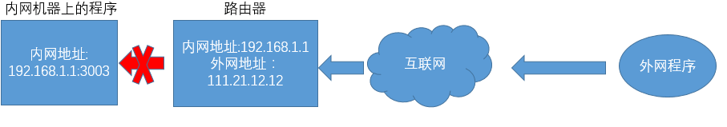
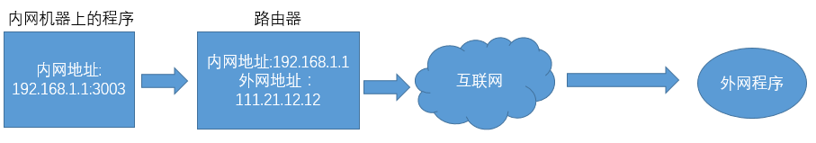
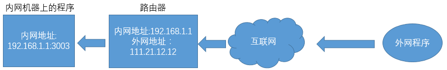

nat 是网络地址转换的意思。 这部分的源码比较独立而且单一，这里就暂时不分析了。 大家了解基本的功能就行了。

nat 下面有 upnp 和 pmp 两种网络协议。

### **upnp 的应用场景(pmp 是和 upnp 类似的协议)**

如果用户是通过 NAT 接入 Internet 的，同时需要使用 BC、电骡 eMule 等 P2P 这样的软件，这时 UPnP 功能就会带来很大的便利。利用 UPnP 能自动的把 BC、电骡 eMule 等侦听的端口号映射到公网上，以便公网上的用户也能对 NAT 私网侧发起连接。

主要功能就是提供接口可以把内网的 IP+ 端口 映射为 路由器的 IP+ 端口。 这样就等于内网的程序有了外网的 IP 地址， 这样公网的用户就可以直接对你进行访问了。 不然就需要通过 UDP 打洞这种方式来进行访问。

### **p2p 中的 UDP 协议**

现在大部分用户运行的环境都是内网环境。 内网环境下监听的端口，其他公网的程序是无法直接访问的。需要经过一个打洞的过程。 双方才能联通。这就是所谓的 UDP 打洞。

接访问内网上的程序是无法实现的。 因为路由器并不知道如何路由数据给内网的这个程序。

那么我们首先通过内网的程序联系外网的程序，这样路由器就会自动给内网的这个程序分配一个端口。并在路由器里面记录一条映射 192.168.1.1:3003 -> 111.21.12.12:3003 。这个映射关系随着时间会老化最终消失。

等路由器建立这样的映射关系后。 互联网上的其他程序就可以快乐的访问 111.21.12.12:3003 这个端口了。因为所有送到这个端口的数据最终会被路由到 192.168.1.1:3003 这个端口。这就是所谓的打洞的过程。

