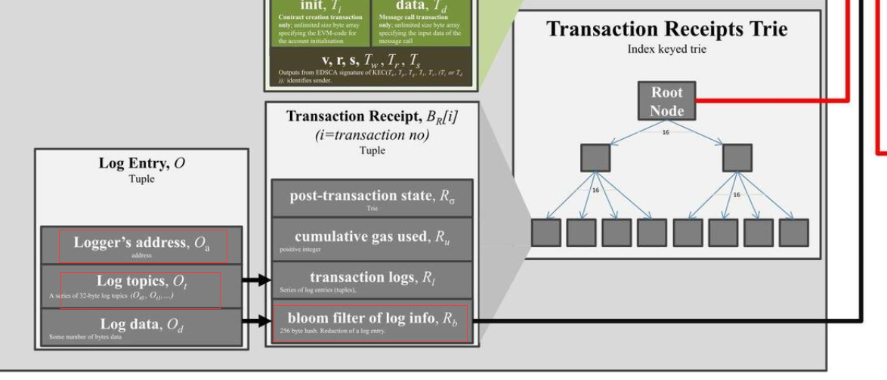
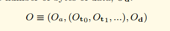
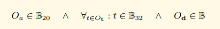
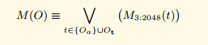
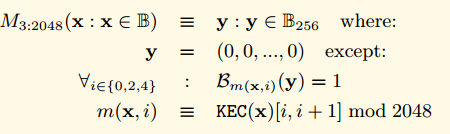
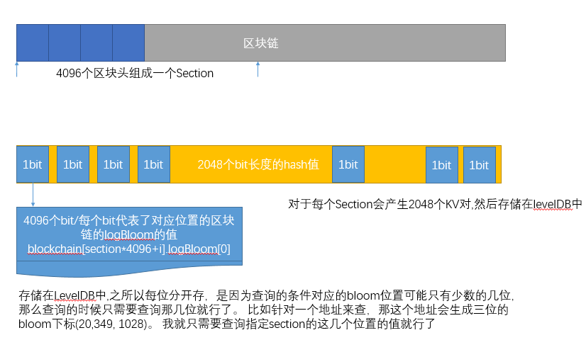

## **以太坊的布隆过滤器**

以太坊的区块头中包含了一个叫做 logsBloom 的区域。 这个区域存储了当前区块中所有的收据的日志的布隆过滤器，一共是 2048 个 bit。也就是 256 个字节。

而我们的一个交易的收据包含了很多的日志记录。 每个日志记录包含了 合约的地址， 多个 Topic。 而在我们的收据中也存在一个布隆过滤器，这个布隆过滤器记录了所有的日志记录的信息。



如果我们看黄皮书里面对日志记录的形式化定义。

O 代表我们的日志记录，Oa 代表 logger 的地址，Oto,Ot1 代表日志的 Topics， Od 代表时间。



Oa 是 20 个字节，Ot 是 32 个字节，Od 是很多字节



我们定义了一个布隆过滤器函数 M，用来把一个日志对象转换成 256 字节的 hash



M3:2045 是一个特别的函数，用来设置 2048 个 bit 位中的三位为 1。 具体的方法请参考下面的公式。



对于任意的输入值，首先求他的 KEC 输出， 然后通过取 KEC 输出的 [0,1] [2,3],[4,5] 这几位的值 对 2048 取模， 得到三个值， 这三个值就是输出的 2048 中需要置位的下标。 也就是说对于任何一个输入，如果它对应的三个下标的值不都为 1，那么它肯定不在这个区块中。 当如如果对应的三位都为 1，也不能说明一定在这个区块中。 这就是布隆过滤器的特性。

收据中的布隆过滤器就是所有的日志的布隆过滤器输出的并集。

同时区块头中的 logBloom，就是所有的收据的布隆过滤器的并集。

## **ChainIndexer 和 BloomIndexer**

最开始看到 ChainIndexer，不是很明白是什么功能。 其实从名字中可以看到，是 Chain 的索引。 在 eth 中我们有看到 BloomIndexer,这个就是布隆过滤器的索引。

在我们的协议中提供了查找指定 Log 的功能。

用户可以通过传递下面的参数来查找指定的 Log,开始的区块号，结束的区块号， 根据合约 Addresses 指定的地址过滤，根据指定的 Topics 来过滤。

```go
// FilterCriteria represents a request to create a new filter.
type FilterCriteria struct {
        FromBlock *big.Int
        ToBlock   *big.Int
        Addresses []common.Address
        Topics    [][]common.Hash
}
```

如果开始和结束之间间隔很大，那么如果直接依次检索每个区块头的 logBloom 区域是比较低效的。 因为每个区块头都是分开存储的， 可能需要非常多的磁盘随机访问。

所以以太坊协议在本地维护了一套索引，用来加速这个过程。

大致原理是。 每 4096 个区块称为一个 Section，一个 Section 里面的 logBloom 会存储在一起。对于每个 Section, 用一个二维数据，A[2048][4096]来存储。 第一维 2048 代表了 bloom 过滤器的长度 2048 个字节。 第二维 4096 代表了一个 Section 里面的所有区块，每一个位置按照顺序代表了其中的一个区块。

- A[0][0]=blockchain[section*4096+0].logBloom[0],
- A[0][1]=blockchain[section*4096+1].logBloom[0],
- A[0][4096]=blockchain[section*4096+1].logBloom[0],
- A[1][0]=blockchain[section*4096+0].logBloom[1],
- A[1][1024]=blockchain[section*4096+1024].logBloom[1],
- A[2047][1]=blockchain[section*4096+1].logBloom[2047],

如果 Section 填充完毕，那么会写成 2048 个 KV。




主要介绍了以太坊中的日志过滤功能，包括 ChainIndexer 和 BloomIndexer 的概念。日志过滤允许用户通过区块范围、合约地址和主题（Topics）来查找指定的日志。为了提高查询效率，


## **bloombit.go 代码分析**

这个代码相对不是很独立，如果单独看这个代码，有点摸不着头脑的感觉， 因为它只是实现了一些接口，具体的处理逻辑并不在这里，而是在 core 里面。 不过这里我先结合之前讲到的信息分析一下。 后续更详细的逻辑在分析 core 的代码的时候再详细分析。

服务线程 startBloomHandlers,这个方法是为了响应具体的查询请求， 给定指定的 Section 和 bit 来从 levelDB 里面查询然后返回出去。 单独看这里有点摸不着头脑。 这个方法的调用比较复杂。 涉及到 core 里面的很多逻辑。 这里先不细说了。 直到有这个方法就行了。

```go
type Retrieval struct {
        Bit      uint                        //Bit的取值 0-2047 代表了想要获取哪一位的值
        Sections []uint64                // 那些Section
        Bitsets  [][]byte                // 返回值 查询出来的结果。
}
// startBloomHandlers starts a batch of goroutines to accept bloom bit database
// retrievals from possibly a range of filters and serving the data to satisfy.
 startBloomHandlers 方法用于响应日志布隆位数据库的检索请求，并在 goroutine 中处理这些请求
func (eth *Ethereum) startBloomHandlers() {
        for i := 0; i < bloomServiceThreads; i++ {             // 启动多个 goroutine 来处理布隆位请求
                go func() {
                        for {
                                select {
                                case <-eth.shutdownChan:      // 如果收到关闭信号，则退出
                                        return

                                case request := <-eth.bloomRequests: // 从请求通道接收一个请求
                                        task := <-request     // 从请求中获取具体的任务

                                        task.Bitsets = make([][]byte, len(task.Sections)) // 为返回结果分配空间
                                        for i, section := range task.Sections {          // 遍历请求中的每个 section
                                                head := core.GetCanonicalHash(eth.chainDb, (section+1)*params.BloomBitsBlocks-1) // 获取 section 的最后一个区块头哈希
                                                blob, err := bitutil.DecompressBytes(core.GetBloomBits(eth.chainDb, task.Bit, section, head), int(params.BloomBitsBlocks)/8) // 从数据库中获取并解压布隆位
                                                if err != nil {
                                                        panic(err) // 如果出错，触发 panic
                                                }
                                                task.Bitsets[i] = blob // 将解压后的数据存入结果
                                        }
                                        request <- task // 通过请求通道返回结果
                                }
                        }
                }()
        }
}
```

### **数据结构**

BloomIndexer 对象主要用户构建索引的过程，是 core.ChainIndexer 的一个接口实现，所以只实现了一些必须的接口。对于创建索引的逻辑还在 core.ChainIndexer 里面。

```go
// BloomIndexer implements a core.ChainIndexer, building up a rotated bloom bits index
// for the Ethereum header bloom filters, permitting blazing fast filtering.
// BloomIndexer 实现了 core.ChainIndexer 的接口，用于构建旋转布隆位的索引，以实现快速日志过滤
type BloomIndexer struct {
        size uint64 // 每个 section 的大小，即包含多少个区块

        db  ethdb.Database       // 数据库实例，用于写入索引数据和元数据
        gen *bloombits.Generator // 用于生成布隆位的生成器

        section uint64      // 当前正在处理的 section 编号
        head    common.Hash // 已处理的最后一个区块头的哈希
}

// NewBloomIndexer returns a chain indexer that generates bloom bits data for the
// canonical chain for fast logs filtering.数据结构
NewBloomIndexer 函数创建并返回一个 core.ChainIndexer 实例，它会生成布隆位数据用于快速日志过滤
func NewBloomIndexer(db ethdb.Database, size uint64) *core.ChainIndexer {
        backend := &BloomIndexer{                      // 创建 BloomIndexer 后端实例
                db:   db,
                size: size,
        }
        table := ethdb.NewTable(db, string(core.BloomBitsIndexPrefix)) // 创建用于存储索引的数据库表

        return core.NewChainIndexer(db, table, backend, size, bloomConfirms, bloomThrottling, "bloombits") // 返回一个新的 ChainIndexer
}
```

Reset 实现了 ChainIndexerBackend 的方法，启动一个新的 section
Reset 方法实现了 core.ChainIndexerBackend 接口，用于启动一个新的布隆位索引 section。
```go
// Reset implements core.ChainIndexerBackend, starting a new bloombits index
// section.
func (b *BloomIndexer) Reset(section uint64) {
        gen, err := bloombits.NewGenerator(uint(b.size)) // 创建一个新的布隆位生成器
        if err != nil {
                panic(err) // 如果出错，触发 panic
        }
        b.gen, b.section, b.head = gen, section, common.Hash{} // 重置生成器、section 编号和头部哈希
}
```

Process 实现了 ChainIndexerBackend， 增加一个新的区块头到 index
Process 方法实现了 core.ChainIndexerBackend 接口，用于向索引中添加一个新的区块头
```go
// Process implements core.ChainIndexerBackend, adding a new header's bloom into
// the index.
func (b *BloomIndexer) Process(header *types.Header) {
        b.gen.AddBloom(uint(header.Number.Uint64()-b.section*b.size), header.Bloom) // 向生成器中添加区块头的布隆过滤器
        b.head = header.Hash() // 更新已处理的最后一个区块头的哈希
}
```

Commit 方法实现了 ChainIndexerBackend，持久化并写入数据库。
Commit 方法实现了 core.ChainIndexerBackend 接口，用于将布隆位 section 持久化写入数据库。
```go
// Commit implements core.ChainIndexerBackend, finalizing the bloom section and
// writing it out into the database.
func (b *BloomIndexer) Commit() error {
        batch := b.db.NewBatch() // 创建一个新的数据库批量操作

        for i := 0; i < types.BloomBitLength; i++ { // 遍历布隆过滤器的每一位
                bits, err := b.gen.Bitset(uint(i)) // 获取指定位的布隆位集合
                if err != nil {
                        return err
                }
                core.WriteBloomBits(batch, uint(i), b.section, b.head, bitutil.CompressBytes(bits)) // 将布隆位写入批量操作
        }
        return batch.Write() // 执行批量写入操作
}
```

## **filter/api.go 源码分析**

 
eth/filter 包提供给用户过滤功能，允许客户端持续获取过滤结果。如果过滤器在 5 分钟内未被轮询，则会被删除
过滤器的结构。

```go
var (
        deadline = 5 * time.Minute // 过滤器在 5 分钟内未被轮询则视为不活跃
)

type filter struct {
        typ      Type                        // 过滤器的类型，如日志、区块或待处理交易
        deadline *time.Timer // 计时器，当其触发时过滤器被视为不活跃
        hashes   []common.Hash // 过滤出来的哈希结果
        crit     FilterCriteria        // 过滤条件
        logs     []*types.Log    // 过滤出来的日志信息
        s        *Subscription // 事件系统中关联的订阅器
}
```

构造方法
PublicFilterAPI 结构体用于创建和管理过滤器，允许外部客户端获取以太坊协议相关信息
```go
// PublicFilterAPI offers support to create and manage filters. This will allow external clients to retrieve various
// information related to the Ethereum protocol such als blocks, transactions and logs.
// PublicFilterAPI用来创建和管理过滤器。 允许外部的客户端获取以太坊协议的一些信息，比如区块信息，交易信息和日志信息。
type PublicFilterAPI struct {
        backend   Backend
        mux       *event.TypeMux
        quit      chan struct{}
        chainDb   ethdb.Database
        events    *EventSystem
        filtersMu sync.Mutex
        filters   map[rpc.ID]*filter
}

func NewPublicFilterAPI(backend Backend, lightMode bool) *PublicFilterAPI {
        api := &PublicFilterAPI{
                backend: backend,
                mux:     backend.EventMux(),
                chainDb: backend.ChainDb(),
                events:  NewEventSystem(backend.EventMux(), backend, lightMode),
                filters: make(map[rpc.ID]*filter),
        }
        go api.timeoutLoop() // 启动超时检查循环

        return api
}
```

### **超时检查**
函数每隔 5 分钟运行一次，删除不活跃的过滤器
```go
// timeoutLoop runs every 5 minutes and deletes filters that have not been recently used.
// Tt is started when the api is created.
// 每隔5分钟检查一下。 如果过期的过滤器，删除。
func (api *PublicFilterAPI) timeoutLoop() {
        ticker := time.NewTicker(5 * time.Minute) // 创建一个 5 分钟的定时器
        for {
                <-ticker.C                        // 等待定时器信号
                api.filtersMu.Lock()              // 获取锁以保护过滤器集合
                for id, f := range api.filters {  // 遍历所有过滤器
                        select {
                        case <-f.deadline.C:      // 如果过滤器的定时器已触发
                                f.s.Unsubscribe() // 取消订阅
                                delete(api.filters, id) // 删除过滤器
                        default:
                                continue // 否则继续
                        }
                }
                api.filtersMu.Unlock()            // 释放锁
        }
}
```

NewPendingTransactionFilter,用来创建一个 PendingTransactionFilter。 这种方式是用来给那种无法创建长连接的通道使用的(比如 HTTP), 如果对于可以建立长链接的通道(比如 WebSocket)可以使用 rpc 提供的发送订阅模式来处理，就不用持续的轮询了
此函数创建一个过滤器，用于获取进入待处理状态的交易哈希，主要用于无法创建长连接的通道
```go
// NewPendingTransactionFilter creates a filter that fetches pending transaction hashes
// as transactions enter the pending state.
//
// It is part of the filter package because this filter can be used throug the
// `eth_getFilterChanges` polling method that is also used for log filters.
//
// https://github.com/ethereum/wiki/wiki/JSON-RPC#eth_newpendingtransactionfilter
func (api *PublicFilterAPI) NewPendingTransactionFilter() rpc.ID {
        var (
                pendingTxs   = make(chan common.Hash)           // 创建一个通道用于接收待处理交易哈希
                pendingTxSub = api.events.SubscribePendingTxEvents(pendingTxs) // 订阅待处理交易事件
        )

        api.filtersMu.Lock()                                     // 获取锁
        api.filters[pendingTxSub.ID] = &filter{typ: PendingTransactionsSubscription, deadline: time.NewTimer(deadline), hashes: make([]common.Hash, 0), s: pendingTxSub} // 创建一个过滤器并添加到集合中
        api.filtersMu.Unlock()                                   // 释放锁

        go func() {                                              // 启动一个 goroutine 处理事件
                for {
                        select {
                        case ph := <-pendingTxs:                 // 从通道接收待处理交易哈希
                                api.filtersMu.Lock()             // 获取锁
                                if f, found := api.filters[pendingTxSub.ID]; found {
                                        f.hashes = append(f.hashes, ph) // 将哈希添加到过滤器的哈希列表中
                                }
                                api.filtersMu.Unlock()           // 释放锁
                        case <-pendingTxSub.Err():               // 如果订阅出错
                                api.filtersMu.Lock()             // 获取锁
                                delete(api.filters, pendingTxSub.ID) // 删除过滤器
                                api.filtersMu.Unlock()           // 释放锁
                                return
                        }
                }
        }()

        return pendingTxSub.ID // 返回过滤器 ID
}
```

轮询: GetFilterChanges
此函数用于轮询，返回从上次调用以来指定 ID 过滤器的所有过滤信息
```go
// GetFilterChanges returns the logs for the filter with the given id since
// last time it was called. This can be used for polling.
// GetFilterChanges 用来返回从上次调用到现在的所有的指定id的所有过滤信息。这个可以用来轮询。
// For pending transaction and block filters the result is []common.Hash.
// (pending)Log filters return []Log.
// 对于pending transaction和block的过滤器，返回结果类型是[]common.Hash. 对于pending Log 过滤器，返回的是 []Log
// https://github.com/ethereum/wiki/wiki/JSON-RPC#eth_getfilterchanges
func (api *PublicFilterAPI) GetFilterChanges(id rpc.ID) (interface{}, error) {
        api.filtersMu.Lock()              // 获取锁
        defer api.filtersMu.Unlock()      // 释放锁

        if f, found := api.filters[id]; found {
                if !f.deadline.Stop() {      // 停止定时器
                        <-f.deadline.C      // 如果定时器已触发，先接收值
                }
                f.deadline.Reset(deadline)   // 重置定时器

                switch f.typ {
                case PendingTransactionsSubscription, BlocksSubscription:
                        hashes := f.hashes
                        f.hashes = nil
                        return returnHashes(hashes), nil // 返回哈希列表并清空
                case LogsSubscription:
                        logs := f.logs
                        f.logs = nil
                        return returnLogs(logs), nil      // 返回日志列表并清空
                }
        }
        return []interface{}{}, fmt.Errorf("filter not found") // 如果过滤器未找到，返回错误
}
```

对于可以建立长连接的通道，可以直接使用 rpc 的发送订阅模式， 这样客户端就可以直接接收到过滤信息，不用调用轮询的方式了。 可以看到这种模式下面并没有添加到 filters 这个容器，也没有超时管理了。也就是说支持两种模式。
此函数创建一个订阅，当交易进入交易池时被触发，主要用于支持长连接的通道
```go
// NewPendingTransactions creates a subscription that is triggered each time a transaction
// enters the transaction pool and was signed from one of the transactions this nodes manages.
func (api *PublicFilterAPI) NewPendingTransactions(ctx context.Context) (*rpc.Subscription, error) {
        notifier, supported := rpc.NotifierFromContext(ctx) // 从上下文中获取通知器
        if !supported {
                return &rpc.Subscription{}, rpc.ErrNotificationsUnsupported // 如果不支持通知，返回错误
        }

        rpcSub := notifier.CreateSubscription() // 创建一个 RPC 订阅

        go func() {
                txHashes := make(chan common.Hash)
                pendingTxSub := api.events.SubscribePendingTxEvents(txHashes) // 订阅待处理交易事件

                for {
                        select {
                        case h := <-txHashes:       // 从通道接收哈希
                                notifier.Notify(rpcSub.ID, h) // 通过通知器发送哈希
                        case <-rpcSub.Err():        // 如果 RPC 订阅出错
                                pendingTxSub.Unsubscribe() // 取消订阅
                                return
                        case <-notifier.Closed():   // 如果通知器关闭
                                pendingTxSub.Unsubscribe() // 取消订阅
                                return
                        }
                }
        }()

        return rpcSub, nil // 返回 RPC 订阅
}
```

日志过滤功能，根据 FilterCriteria 指定的参数，来对日志进行过滤，开始区块，结束区块，地址和 Topics，这里面引入了一个新的对象 filter

```go
// FilterCriteria represents a request to create a new filter.
type FilterCriteria struct {
        FromBlock *big.Int
        ToBlock   *big.Int
        Addresses []common.Address
        Topics    [][]common.Hash
}
        
// GetLogs returns logs matching the given argument that are stored within the state.
//此函数根据 FilterCriteria 中指定的参数返回匹配的日志
// https://github.com/ethereum/wiki/wiki/JSON-RPC#eth_getlogs
func (api *PublicFilterAPI) GetLogs(ctx context.Context, crit FilterCriteria) ([]*types.Log, error) {
        if crit.FromBlock == nil {
                crit.FromBlock = big.NewInt(rpc.LatestBlockNumber.Int64()) // 如果未指定起始区块，则使用最新区块
        }
        if crit.ToBlock == nil {
                crit.ToBlock = big.NewInt(rpc.LatestBlockNumber.Int64()) // 如果未指定结束区块，则使用最新区块
        }
        filter := New(api.backend, crit.FromBlock.Int64(), crit.ToBlock.Int64(), crit.Addresses, crit.Topics) // 创建一个新的过滤器

        logs, err := filter.Logs(ctx) // 调用过滤器的 Logs 方法获取日志
        if err != nil {
                return nil, err
        }
        return returnLogs(logs), err // 返回日志
}
```

## **filter.go**

 
中定义了 Filter 对象，用于根据区块的 BloomIndexer 和布隆过滤器执行日志过滤功能。
### **数据结构**

```go
// Backend interface 用于定义后端需要实现的方法，主要与 core 包的逻辑相关
type Backend interface {
        ChainDb() ethdb.Database
        EventMux() *event.TypeMux
        HeaderByNumber(ctx context.Context, blockNr rpc.BlockNumber) (*types.Header, error)
        GetReceipts(ctx context.Context, blockHash common.Hash) (types.Receipts, error)

        SubscribeTxPreEvent(chan<- core.TxPreEvent) event.Subscription
        SubscribeChainEvent(ch chan<- core.ChainEvent) event.Subscription
        SubscribeRemovedLogsEvent(ch chan<- core.RemovedLogsEvent) event.Subscription
        SubscribeLogsEvent(ch chan<- []*types.Log) event.Subscription

        BloomStatus() (uint64, uint64) // 返回布隆过滤器的状态
        ServiceFilter(ctx context.Context, session *bloombits.MatcherSession) // 服务过滤器
}

// Filter can be used to retrieve and filter logs.
type Filter struct {
        backend Backend                  // 后端实例

        db         ethdb.Database        // 数据库
        begin, end int64                  // 过滤的起始和结束区块号
        addresses  []common.Address        // 筛选的地址
        topics     [][]common.Hash        // 筛选的主题

        matcher *bloombits.Matcher        // 布隆过滤器的匹配器
}
```

构造函数把 address 和 topic 都加入到 filters 容器。然后构建了一个 bloombits.NewMatcher(size, filters)。这个函数在 core 里面实现， 暂时不会讲解。
New 函数创建一个新的 Filter，使用布隆过滤器对区块进行过滤
```go
// New creates a new filter which uses a bloom filter on blocks to figure out whether
// a particular block is interesting or not.
func New(backend Backend, begin, end int64, addresses []common.Address, topics [][]common.Hash) *Filter {
        var filters [][][]byte
        if len(addresses) > 0 {
                filter := make([][]byte, len(addresses))
                for i, address := range addresses {
                        filter[i] = address.Bytes()
                }
                filters = append(filters, filter)
        }
        for _, topicList := range topics {
                filter := make([][]byte, len(topicList))
                for i, topic := range topicList {
                        filter[i] = topic.Bytes()
                }
                filters = append(filters, filter)
        }
        size, _ := backend.BloomStatus()

        return &Filter{
                backend:   backend,
                begin:     begin,
                end:       end,
                addresses: addresses,
                topics:    topics,
                db:        backend.ChainDb(),
                matcher:   bloombits.NewMatcher(size, filters), // 创建一个新的布隆过滤器匹配器
        }
}
```

Logs 执行过滤
Logs 函数在区块链上搜索匹配的日志条目
```go
// Logs searches the blockchain for matching log entries, returning all from the
// first block that contains matches, updating the start of the filter accordingly.
func (f *Filter) Logs(ctx context.Context) ([]*types.Log, error) {
        header, _ := f.backend.HeaderByNumber(ctx, rpc.LatestBlockNumber)
        if header == nil {
                return nil, nil
        }
        head := header.Number.Uint64()

        if f.begin == -1 {
                f.begin = int64(head)
        }
        end := uint64(f.end)
        if f.end == -1 {
                end = head
        }
        var (
                logs []*types.Log
                err  error
        )
        size, sections := f.backend.BloomStatus()
        if indexed := sections * size; indexed > uint64(f.begin) { // 如果过滤范围落在已创建索引的部分
                if indexed > end {
                        logs, err = f.indexedLogs(ctx, end) // 执行索引搜索
                } else {
                        logs, err = f.indexedLogs(ctx, indexed-1)
                }
                if err != nil {
                        return logs, err
                }
        }
        rest, err := f.unindexedLogs(ctx, end) // 对剩下的部分执行非索引搜索
        logs = append(logs, rest...)
        return logs, err
}
```

索引搜索
此函数基于本地或网络可用的布隆位索引返回匹配的日志
```go
// indexedLogs returns the logs matching the filter criteria based on the bloom
// bits indexed available locally or via the network.
func (f *Filter) indexedLogs(ctx context.Context, end uint64) ([]*types.Log, error) {
        matches := make(chan uint64, 64)
        session, err := f.matcher.Start(uint64(f.begin), end, matches) // 启动一个匹配器会话
        if err != nil {
                return nil, err
        }
        defer session.Close(time.Second) // 确保会话关闭
        
        f.backend.ServiceFilter(ctx, session) // 请求后端服务过滤器

        var logs []*types.Log

        for {
                select {
                case number, ok := <-matches: // 从匹配通道接收区块号
                        if !ok { // 如果通道已关闭
                                f.begin = int64(end) + 1 // 更新起始区块号
                                return logs, nil
                        }
                        header, err := f.backend.HeaderByNumber(ctx, rpc.BlockNumber(number)) // 获取区块头
                        if header == nil || err != nil {
                                return logs, err
                        }
                        found, err := f.checkMatches(ctx, header) // 检查区块中是否有匹配的日志
                        if err != nil {
                                return logs, err
                        }
                        logs = append(logs, found...) // 将找到的日志添加到结果中

                case <-ctx.Done(): // 如果上下文被取消
                        return logs, ctx.Err()
                }
        }
}
```

checkMatches,拿到所有的收据，并从收据中拿到所有的日志。 执行 filterLogs 方法。
此函数检查给定区块头所属的收据是否包含与过滤器条件匹配的日志事件
```go
// checkMatches checks if the receipts belonging to the given header contain any log events that
// match the filter criteria. This function is called when the bloom filter signals a potential match.
func (f *Filter) checkMatches(ctx context.Context, header *types.Header) (logs []*types.Log, err error) {
        receipts, err := f.backend.GetReceipts(ctx, header.Hash()) // 获取区块的收据
        if err != nil {
                return nil, err
        }
        var unfiltered []*types.Log
        for _, receipt := range receipts {
                unfiltered = append(unfiltered, ([]*types.Log)(receipt.Logs)...) // 获取所有日志
        }
        logs = filterLogs(unfiltered, nil, nil, f.addresses, f.topics) // 过滤日志
        if len(logs) > 0 {
                return logs, nil
        }
        return nil, nil
}
```

filterLogs,这个方法从给定的 logs 里面找到能够匹配上的。并返回。
此函数从给定的日志切片中找到并返回匹配特定条件的日志
```go
// filterLogs creates a slice of logs matching the given criteria.
func filterLogs(logs []*types.Log, fromBlock, toBlock *big.Int, addresses []common.Address, topics [][]common.Hash) []*types.Log {
        var ret []*types.Log
Logs:
        for _, log := range logs {
                if fromBlock != nil && fromBlock.Int64() >= 0 && fromBlock.Uint64() > log.BlockNumber {
                        continue
                }
                if toBlock != nil && toBlock.Int64() >= 0 && toBlock.Uint64() < log.BlockNumber {
                        continue
                }

                if len(addresses) > 0 && !includes(addresses, log.Address) {
                        continue
                }
                if len(topics) > len(log.Topics) {
                        continue Logs
                }
                for i, topics := range topics {
                        match := len(topics) == 0
                        for _, topic := range topics {
                                if log.Topics[i] == topic {
                                        match = true
                                        break
                                }
                        }
                        if !match {
                                continue Logs
                        }
                }
                ret = append(ret, log)
        }
        return ret
}
```

unindexedLogs,非索引查询，循环遍历所有的区块。 首先用区块里面的 header.Bloom 来看是否有可能存在，如果有可能存在， 再使用 checkMatches 来检索所有的匹配。
此函数通过遍历所有区块并使用布隆过滤器进行匹配来查找日志。
```go
// indexedLogs returns the logs matching the filter criteria based on raw block
// iteration and bloom matching.
func (f *Filter) unindexedLogs(ctx context.Context, end uint64) ([]*types.Log, error) {
        var logs []*types.Log

        for ; f.begin <= int64(end); f.begin++ {
                header, err := f.backend.HeaderByNumber(ctx, rpc.BlockNumber(f.begin)) // 获取区块头
                if header == nil || err != nil {
                        return logs, err
                }
                if bloomFilter(header.Bloom, f.addresses, f.topics) { // 使用布隆过滤器检查是否有潜在匹配
                        found, err := f.checkMatches(ctx, header)
                        if err != nil {
                                return logs, err
                        }
                        logs = append(logs, found...) // 将找到的日志添加到结果中
                }
        }
        return logs, nil
}
```

## **总结**

filter 源码包主要实现了两个功能，

- 提供了 发布订阅模式的 filter RPC。用来给 rpc 客户端提供实时的交易，区块，日志等的过滤
- 提供了 基于 bloomIndexer 的日志过滤模式，这种模式下，可以快速的对大量区块执行布隆过滤操作。 还提供了历史的日志的过滤操作。
